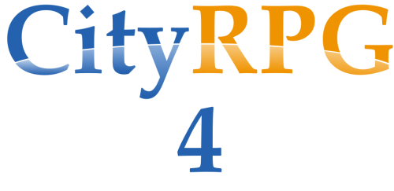

# 
Live, build, and thrive in a city made of blocks, inhabited by players like you.

CityRPG is a mod for the game Blockland that simulates the life of a blocky city. Each city is built, run, and populated by the players. It’s a sandbox-RPG-simulation blend with limitless potential.

In CityRPG 4, you can explore a range of jobs and opportunities as you work your way to the top! You can join the fun on an existing server, or create your own server with any theme, rules, and style that you like

[Join us on Discord](https://discord.gg/dHcnHb3) | [View update progress on Trello](https://trello.com/b/36wGp6ow/cityrpg-4-roadmap)
------------ | ------------- |

## Features in Alpha 1
- The classic gameplay that has been shaped by thousands of players within the Blockland community
- A variety of jobs and roles to partake in
- Shops that are built and run entirely by players
- A dynamic, highly configurable system for handling player-created builds and in-game real estate

## Created by the CityRPG 4 Team
Development: Lake

Directors: PunisherLex, Qauk, and Sargeras

### Special thanks
The CityRPG 4 testers: Alphabite, Dglider, Jasa, Luigi609, Mega Bear, Remurr, Snack Nsack Chocolate, Stargatefan

The previous CityRPG developers: Jookia/PeopleMods, Iban, Diggy/Wentworth, McTwist, Gadgethm, Aoki, /Ty, and many more.

Dglider for bugfixes and tips, Sentry for replacing missing assets.

# Commands

## Gameplay
- **/help** - Displays in-game help information for playing CityRPG.
- **/lot** - Opens the lot management menu for the lot you are on.
- **/reincarnate** - For players in the endgame.

## Admin Commands
- **/updateScore** - Updates scores in the player list.
- **/setMinerals** - Sets the mineral count for the city. This affects item sales.
- **/setLumber** - Sets the total lumber for the city. This affects item sales.
- **/editEducation** [level] [player] - Changes a player's education level.
- **/gMoney** [amount] [player] - Grant money to a player.
- **/dMoney** [amount] [player] - Remove money from a player's inventory.
- **/clearMoney** - Clear all cash from your character. Does not take from your bank.
- **/dBank** [amount] [player] - Remove money from a player's bank.
- **/cleanse** - Removes your wanted level.
- **/edithunger** [level 1-10] - Changes hunger to a certain level.

# Developer Documentation
CityRPG 4 is being built fully open source, and we encourage you to fork the repository and make your own changes. We would love to see your contributions!

Below is an incomplete documentation of key functions in CityRPG 4.

## GameConnection::cityMenuOpen(names, functions, exitMsg, autoClose)
Displays a generic menu, currently using a chat-based approach. Returns true if the menu opens successfully. No eval or script object handling is necessary.

While this currently resembles the mechanics of classic CityRPG menus (chat-based, type a number), the method of displaying menus is subject to change. For best results, make sure to check client.cityMenuOpen before attempting. Take note of the default 8-line chat limit.

**Args:**
- exitMsg: The message to display when the menu closes
- menu: A set of fields containing names for each menu item.
- functions: The function that will be called corresponding with each name option. The %client argument and user input will be respectively passed to this function.
- menuID: A unique identifier for the menu, for reference elsewhere. Generally set to the brick that triggered it.
- autoClose: (Bool) If set to 'true', the menu will close as soon as the function executes.

**Example:**
```
%menu = "Option 1" TAB "Option 2";
%functions = "announce" TAB "talk";
findClientByName(Blockhead).cityMenuOpen(%menu, %functions, "", "", true);
```

Result:
Typing "1" will show the client's ID in yellow text. ("announce()")
Typing "2" will show the client's ID with a "CONSOLE: " chat message. ("talk()

To prompt the user for text, direct client.cityMenuFunction to a new function with the arguments `client` and `input`. The user's next raw text input will be passed to the function as `input`.

For further reference, check lotRegistry.cs for a complex utilization of the cityMenuOpen function.

### Pre-existing generic functions
This is a list of existing functions for menus. These functions should be used where possible to avoid redundancy in creating extra menu functions.

- CityMenu_Close - Closes the menu.
- CityMenu_Placeholder - Displays the text "Sorry, this feature is currently not available. Please try again later."

## CityRPGBatonImage::onCityPlayerHit(obj, slot, col, pos, normal)
Allows the creation of additional checks when players are batoned. MUST return `true` if a check is passed, otherwise baton actions will overlap each other.

Shares the same arguments as the CityRPGBatonImage::onHitObject function.

## CityRPGLBImage::onCityPlayerHit(obj, slot, col, pos, normal)
See CityRPGBatonImage::onCityPlayerHit

## gameConnection::arrest(client, cop)
**Deprecated**

Called when `client` is arrested by `cop`.

## City_illegalAttackTest(atkr, victim)
**Deprecated**

Called when players are attacked, determines if an attack is to incur demerits as an assault. Returns `false `
